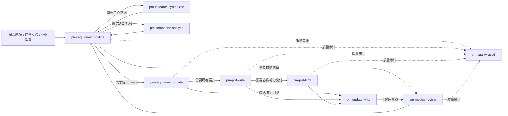

# PM Workflow Skills 使用与协作指南

这套 workflow 的目标是让 Codex 在产品工作中稳定完成三件事：**补证据、做决策、按风险交付**。不要把它理解成“想写哪个文档就调用哪个 skill”；每个 skill 都有明确输入成熟度、输出契约和上下游边界。

## 0. 总体工作流



默认主线是：`pm-requirement-define` → `pm-requirement-grade` → 按等级交付。每个阶段在交给下一环节前都要经过 `pm-quality-audit`；审计不是润色，而是判断是否真的达到交接门槛。需要完整规格时进入 `pm-prd-write`；需要团队视觉评审时，再由 `pm-prd-html` 将已确认 PRD 编译为“问题 → 主线 → 页面状态 → 内容 → 原型 → 规则 → 评审点”的阅读版，并在同一 HTML 内保留可按需回看的完整规格、固定侧栏和内嵌黑白灰 SVG。对要求设计前评估页面效果的需求，页面内容契约是 PRD 的用户可见内容主源，HTML 不能依赖设计稿补齐信息。研究、竞品和指标是证据增强 skill，只在 `pm-requirement-define` 判断缺口会影响决策时使用，并在形成证据包后回到需求定义；更新说明和指标复盘是交付后的同步与验证 skill。

## 1. Skill 职责地图

| 阶段 | 首选 skill | 触发信号 | 不该做什么 | 标准输出 |
|---|---|---|---|---|
| 证据综合 | `pm-research-synthesize` | 有访谈、问卷、客服、可用性测试、开放反馈，需要提炼用户模式 | 不从少量材料直接拍唯一方案 | 研究问题、证据强度、用户 / 场景差异、机会和局限 |
| 外部机制分析 | `pm-competitor-analyze` | 需要对比竞品、替代方式、单品机制或行业做法 | 不把竞品做法直接当需求 | 决策问题、证据台账、机制差异、可借鉴原则和验证建议 |
| 指标判断 | `pm-metrics-review` | 目标复盘、上线评估、异常诊断、规模或效果证据不足 | 不在口径不明时下因果结论 | 指标口径、数据质量、事实表现、原因假设、行动建议 |
| 产品决策 | `pm-requirement-define` | 为什么做、做什么方向、做到哪里尚未确认 | 不写页面字段、状态权限、研发验收和发布方案 | 问题、目标、方向、一级范围、非目标、重大约束、成功假设 |
| 风险门禁 | `pm-requirement-grade` | 需求定义基本完成，需要判断交付等级和 AI Coding 边界 | 不重新发散方向，不跳过红线；体验交付复杂度独立于风险等级 | L0/L1/L2/L3/H、AI Coding 结论、体验交付复杂度、内容完整型 UX 原型门槛、交付路由和下一步 |
| 交付规格 | `pm-prd-write` | 已有需求定义和分级结论，需要评审、实现、测试、发布 | 不重新做方向决策，不写接口字段 / 算法实现；复杂体验按信号形成页面地图、状态架构、组件行为、端与布局矩阵和原型覆盖计划；命中内容完整型 UX 原型时建立页面内容契约和内容覆盖 | PRD、评审简版、原型规划、页面内容契约、验收矩阵、研发 spec 交接清单 |
| 协作视觉交付 | `pm-prd-html` | 已确认 PRD，需要给产品、设计、研发、测试提供更易读的协作评审物 | 不重新做产品决策，不生成多个文档，不使用 PNG，不维护第二套规则；只编译 PRD 已确认的复杂体验中间层，并检查页面内容覆盖 | 单文件 `prd.html`，按阅读任务重组内容，保留可按需回看的完整规格，带固定可收起侧栏、真实视窗内可滚动的黑白灰 SVG 原型 / 流程图、需求上下文、覆盖台账和一致性检查 |
| 变化同步 | `pm-update-write` | 已确认结论、范围、上线内容或计划变化需要同步 | 不补做需求定义，不替代 PRD，不解释未验证因果 | 更新说明、变更通知、更新日志、行动项 |
| 质量审计 | `pm-quality-audit` | 已有产品产物，需要判断是否完整、严谨、可交接 | 不替代原 skill 写正文，不补造事实，不用平均分掩盖硬缺陷 | 质量审计报告、缺陷清单、追溯矩阵、放行结论 |

## 2.1 质量闭环：从“有产出”到“可交接”

每个产物分成两层状态：

1. **生成完成**：已按对应 skill 的方法和输出结构生成。
2. **质量通过**：已经过独立审计，关键上下文、逻辑、覆盖、追溯和下游执行条件达到门槛。

统一审计结果：

- `PASS`：无未解决 Blocker / Major，可以交给下一环节；
- `PASS_WITH_CONDITIONS`：无 Blocker，但 Major 已登记责任人、动作和完成条件；
- `BLOCKED`：存在 Blocker，或关键上下文不足，必须补证据、做决策或回退上游。

审计最少执行：

1. 建立上下文充分性账本，区分 `confirmed / inferred / assumed / unknown / blocked`；
2. 做反事实、遗漏、矛盾、过度确定、下游可执行和 10 倍规模检查；
3. 建立阶段覆盖矩阵和最小追溯矩阵；
4. 先只报告问题，再修复，再复审受影响范围；
5. 不用总分抵消硬缺陷，不为得到 PASS 补造事实。

质量维度与阶段门槛见 [产品交付质量框架](./shared-references/产品交付质量框架.md)。

触发原则：讨论 / 草稿 / 脑暴默认不自动审计；输出 `ready`、最终分级、准备交给设计 / 研发 / 测试 / 运营，或用户要求复核 / 验收时，原 skill 必须在本次交付前调用 `pm-quality-audit`。审计结果默认作为对话中的结构化报告返回；只有用户要求留档或作为交接附件时，才写入项目根目录 `quality-audits/`。

## 2.2 实际协作方式

不要把每次调用都理解成“生成最终稿”。建议把一次工作拆成探索态和交接态：

### 探索态：允许快速迭代

适用于方向还在讨论、信息还在补齐或需要比较多个方案时。可以这样说：

```text
先用 pm-requirement-define 给我一个可讨论初稿，不要急着审计。
```

此时产物应明确标记“未审计”，不能直接称为“已确认”或交给下游。

### 交接态：自动触发质量审计

当你需要进入下一环节时，明确交接目标：

```text
请把这份需求定义收敛到可以进入分级的 ready 状态，并在交付前自动审计；如果 BLOCKED，不要继续往下写。
```

目标 skill 先生成产物，再调用 `pm-quality-audit audit-only`。如果审计发现问题，通常有三种处理：

1. 回到原 skill 修复；
2. 回到研究 / 竞品 / 指标 skill 补证据；
3. 回到用户或产品负责人处补决策。

只有 `PASS`，或用户明确接受带责任人和完成条件的 `PASS_WITH_CONDITIONS`，才可以交给下一环节。

### 明确审计或修复

需要强制审计时可以直接说：

```text
请用 pm-quality-audit 对刚才的 PRD 做 audit-only 审计，不要修改原文。
```

需要边审边修时可以说：

```text
请审计并修复刚才的 PRD，先列出问题，再回到 pm-prd-write 修复，最后复审受影响范围。
```

### 报告留档

默认审计报告返回在当前对话中。如果需要形成正式交接附件，可以说：

```text
请把本次质量审计报告留档，作为后续研发交接附件。
```

报告写入当前项目根目录的 `quality-audits/`，文件名按“日期 + 阶段 + quality-audit”生成。它记录的是某个产物版本在某个时间点的质量状态；原产物发生影响内容的修改后，报告自动失效，需要重新审计。

## 2. 输入成熟度判断

开始前先把用户输入分成四类：

1. **原始诉求**：只有一句想法、老板要求、用户反馈或竞品截图。先进入 `pm-requirement-define` 做前置判断；如缺口会影响决策，再按缺口路由到研究、竞品或指标，并带着证据包回到需求定义。
2. **证据材料**：已有访谈 / 数据 / 竞品材料，但还没有产品结论。先用对应证据 skill 综合，再交回 `pm-requirement-define`。
3. **已确认需求**：问题、目标、方向、一级范围和非目标基本清楚。进入 `pm-requirement-grade`，先定交付等级，再决定是否写 PRD。
4. **已确认变更或上线结果**：结论已经确定，只需要同步或复盘。分别进入 `pm-update-write` 或 `pm-metrics-review`。

不要用“资料还不完整”作为万能追问理由。先判断缺口归属：项目事实自行查；用户 / 竞品 / 数据证据交给证据 skill；产品决策缺口才追问或深度质询；会影响等级的风险线索交给 `pm-requirement-grade`；页面行为、状态权限和验收交给 PRD；接口、队列、存储和算法交给研发 spec。

## 3. 标准交接契约

### 3.1 C1 证据包 → 需求定义

研究、竞品和指标 skill 交回 `pm-requirement-define` 时，至少包含：

- 本次要支持的决策问题。
- 已确认事实、证据来源、时间范围和适用场景。
- 证据强度、反例、局限和不能下的结论。
- 对问题、目标、方向、范围或投入判断的影响。
- 下一步建议：进入需求定义、补证据、低成本验证、继续观察或暂缓。

证据包只提供判断依据，不替代产品负责人做方向选择。

### 3.2 C2 需求定义 → 需求分级

`pm-requirement-define` 达到 `ready` 后，默认交给 `pm-requirement-grade`，而不是直接进入 PRD。交接至少包含：

- 用户 / 场景 / 问题和证据依据。
- 目标、非目标、成功假设和护栏。
- 推荐方向、未选方向和关键取舍。
- 一级范围、涉及端、主要角色、入口 / 页面 / 模块线索。
- 已知体验复杂度线索：多页面导航 / 跨页状态、独立状态域 / 并行异步、复杂列表或表单、多端差异、显著角色差异和状态组合规模。
- 如果要求设计前评估完整页面效果：页面内容完整性目标、不可由设计稿补齐的用户可见内容、需要覆盖的状态 / 端形态和当前信息缺口。
- 重大约束：资金、权益、登录、隐私、生产数据、状态机、核心链路、第三方、AI 自动化、成本放大、回滚等。
- 已知待确认项、负责人、最晚确认时间和对等级的影响。

如果这些缺口会改变等级，`pm-requirement-grade` 必须退回上游补齐，不能默认按 L1 处理。

### 3.3 C3 需求分级 → 交付执行

`pm-requirement-grade` 是交付前统一门禁，输出必须先给评级结论，再给对应路由包 / 门禁要求和体验交付复杂度。体验交付复杂度只决定下游 PRD / HTML 的中间层，不能改变 L0/L1/L2/L3/H 风险等级：

| 等级 | 允许路径 | 路由包 / 门禁 | 典型下游 |
|---|---|---|---|
| L0 | 可轻量处理 | 变更记录、影响范围、验证方式 | 更新记录 / 直接执行 |
| L1 | 产品 / 业务方可在门禁内 AI Coding 自助 | AI Coding 任务边界、禁止项、文件白名单、自测和上线前检查 | AI Coding、代码审查、上线观察 |
| L2 | 需要产品、研发、设计、测试协作 | 协作简报、影响面评估、QA、回滚和观察 | 协作交付；复杂时进入 `pm-prd-write` 评审简版 |
| L3 | 不允许自助上线 | PRD 输入摘要、研发 spec 评审主题、评审清单、灰度 / 回滚 / 监控要求 | `pm-prd-write`、研发 spec、测试方案、发布治理 |
| H | 线上问题先止血 | hotfix 记录、影响范围、止血方案、验证、补偿 / 长期修复 | 值班研发、复盘，必要时回 L2/L3 |

### 3.4 C4 PRD → 研发 / 测试 / 更新

`pm-prd-write` 接收 C2 + C3，不重新定义需求方向。PRD 至少交付：

- 决策依据摘要、范围、非目标和分级结论。
- 方案闭环、页面 / 信息区 / 用户路径和原型索引。
- 功能行为规格、规则、状态、权限、异常、历史兼容和联动。
- 系统能力需求表：只写产品能力、触发时机、用户可见结果和失败兜底。
- 验收矩阵、指标方案、发布 / 灰度 / 回滚 / 监控要求。
- 研发 spec 交接清单：接口字段、错误码、队列、存储、算法、监控实现等由研发继续定义。
- 原型规划：涉及页面体验时，PRD 还应说明页面 × 状态、共享页面骨架、可视化覆盖、主操作、下一状态，以及移动端视口、页面长度、固定区域和状态锚点等现实约束；要求设计前评估完整页面效果时，还必须逐项列出所有用户可见静态文案、动态字段、状态标签、按钮、placeholder、空态、错误和操作反馈，形成页面内容契约与页面 × 状态 × 内容覆盖；体验交付复杂度为“复杂”时，按命中信号补充页面地图与导航契约、状态架构、复杂组件行为、端与布局矩阵、原型覆盖计划；它们是 `pm-prd-html` 的输入，不是独立原型文件。

需要团队可视化评审时，将已确认 PRD 交给 `pm-prd-html`。它必须把正式 PRD 编译成可顺着阅读的结构，并在同一 HTML 内提供按章节回看的完整规格；固定可收起侧栏用于定位，原型默认使用黑白灰 SVG 线框，长页在真实手机视窗内滚动，状态切换定位到 PRD 已声明的用户视口锚点，原型外再展示需求、规则和验收上下文。命中内容完整型 UX 原型时，原型中的用户可见内容必须全部可回溯到内容契约，并报告未覆盖 / 待确认 / 阻塞项；复杂体验按页面地图、状态架构、组件行为、端与布局矩阵和覆盖计划编译代表故事，并可核对成图与豁免依据。它只编译和重组内容，发现产品逻辑、状态迁移或重大取舍问题时必须回到 `pm-prd-write`，不在 HTML 中另立口径。PRD 确认后，可用 `pm-update-write` 生成评审通知、上线说明、运营口径或更新日志。

### 3.5 C5 上线 / 更新 → 指标复盘

上线或同步后，进入观察和复盘：

- L1 / L2 至少记录上线观察：错误、投诉、核心路径、关键转化和回滚信号。
- L3 / H 必须定义观察周期、护栏、暂停 / 回滚条件和负责人。
- 达到观察窗口后，用 `pm-metrics-review` 判断继续、放量、调整、回滚、补实验或回到 `pm-requirement-define`。

## 4. 页面内容完整型 UX 原型专项

“原型能评估页面效果”不是要求 PRD 替代视觉设计，而是要求在视觉设计前先锁定页面的内容和交互事实。命中该目标时，统一使用以下顺序：

1. 需求定义记录页面评审要回答的问题，以及哪些用户可见内容不能由设计稿补齐；
2. 分级标记“内容完整型 UX 原型”门槛，不在分级阶段展开字段；
3. PRD 建立页面信息结构、页面内容契约、状态架构 / 组合矩阵和原型覆盖计划；
4. HTML 按页面 × 状态 × 内容编译完整用户可见页面，检查内容是否覆盖，不得用通用占位或设计稿作为补充主源；
5. 发现缺失文案、状态、信息区、主操作或异常出口时，回退 PRD，不在 HTML 或设计稿中静默补造。

四类产物的边界见[页面内容契约与 UX 原型](./shared-references/页面内容契约与UX原型.md)。页面内容契约维护“页面上有什么”，状态矩阵维护“什么时候出现 / 变化”，UX 原型维护“如何排列、滚动、切换和反馈”。

## 4. 理想工作流实践

### 4.1 新需求从 0 到交付

1. 用 `pm-requirement-define` 收敛问题、目标、方向、一级范围和非目标。
2. 若缺少关键证据，只调用一个最能补决策缺口的证据 skill；不要为了“完整”把研究、竞品、指标全跑一遍。
3. 需求定义 `ready` 后，用 `pm-requirement-grade` 输出等级和交付路由。
4. L1 直接拿任务边界进入 AI Coding；L2 用协作简报对齐；L3 再用 `pm-prd-write` 写完整 PRD。涉及页面体验和团队视觉评审时，在 PRD 的产品逻辑确认后调用 `pm-prd-html`。
5. 交付确认后用 `pm-update-write` 同步受众；上线后用观察记录和 `pm-metrics-review` 闭环。

### 4.2 L1 AI Coding 自助

适合：独立、非核心、范围清楚、可完整自测、可快速回滚，不碰红线的局部修改。

必须保留：分级依据、文件白名单、禁止修改、验收标准、自测记录、构建 / lint 结果、截图或录屏、回滚方式、上线观察。任何资金、登录、隐私、权益、核心链路、生产写入、状态机、全局配置、外部依赖或不可快速回滚风险，都不得降级为 L1。

### 4.3 L2 协作交付

适合：影响已有页面、共享组件、已有接口展示或历史路径，但风险可控且未触及 L3 红线。

最低实践：协作简报 + 研发影响面评估 + 设计边界确认 + QA 回归 + 至少 1 名研发 Code Review + 1-3 天上线观察。若 L2 需求跨多页面、多角色、复杂状态或有大量验收分支，使用 `pm-prd-write` 输出评审简版或标准 PRD；需要团队视觉评审时，再用 `pm-prd-html` 生成单文件 HTML。

### 4.4 L3 高风险交付

适合：资金、交易、权益、身份、隐私、生产数据写入、状态机、AI 自动化结果、核心链路、全局配置、外部依赖或不可快速回滚。

最低实践：完整 PRD + 研发 spec + 测试方案 + 安全 / 合规 / 数据口径确认（按风险）+ Feature Flag / 灰度 + 可观测指标与告警 + 回滚 / 降级 / 补偿预案 + 上线后复盘。L3 不允许产品或业务方自助 AI Coding 后直接上线。

### 4.5 H hotfix

适合：线上已发生或正在发生的问题，需要先止血。

先做影响范围、止血方案、验证和回滚判断；不要在事故压力下补造长期产品方案。止血后必须判断是否回到 L2 / L3 正常流程补长期修复，并用 `pm-metrics-review` 或复盘记录沉淀原因和后续动作。

## 5. 统一规范

### 5.1 单一事实来源

- 需求方向以 `pm-requirement-define` 的最新决策为准。
- 交付等级以 `pm-requirement-grade` 的最新结论为准。
- 体验交付复杂度以 `pm-requirement-grade` 的最新结论为准；页面地图、状态架构、组件行为、端与布局、页面内容契约和原型覆盖以确认后的 PRD 为准；命中内容完整型 UX 原型时，HTML 只能消费 PRD 内容契约，不得以设计稿作为内容主源。
- 功能规则和验收以确认后的 PRD 为准。
- 实现字段、接口、队列、存储、算法以研发 spec 为准。
- 对外或跨团队同步以已确认 PRD / 分级产物 / 上线结论为来源，不在更新文案中新增规则。

### 5.2 信息状态标签

所有阶段统一使用四类标签：

- `已确认`：有明确输入、资料来源或负责人确认。
- `分析推断`：基于证据得出的判断，必须说明依据。
- `待确认`：缺口会影响决策、等级、实现或验收，必须写负责人、最晚时间和阻塞影响。
- `不适用`：说明为什么当前场景不需要，而不是留空。

### 5.3 不重复工作

允许下游摘要上游结论以保证文档自包含；不允许下游重新发散方向、改写目标、扩大一级范围或绕过分级门禁。发现上游结论不成立时，暂停当前文档并回到对应上游 skill，而不是在下游文档里悄悄修正。

### 5.4 风险只升不降

按最高风险定级。代码量小、页面少、改动看似简单、AI 能实现、时间紧，都不能降低等级。项目画像和项目红线高于通用矩阵。

## 6. 项目上下文和 XQD 兼容

通用流程只抽象方法，不覆盖项目事实。进入具体项目时，优先读取项目仓库的 `AGENTS.md`、README、产品文档索引、历史方案和项目画像。

识别到兴趣岛/XQD、`xqd-learning-weapp`、小程序、课程、直播、回放、支付或权益时，必须叠加 `pm-requirement-grade` 中的 xqd 项目画像：课程、直播、回放、支付、权益、登录、隐私、核心学习链路等风险不得因为“只是小程序改动”或“只是配置 / 展示”而降级。

## 7. 维护与审查

修改 workflow 主线、skill 边界或分级门禁时，必须同步检查 README、WORKFLOW_GUIDE、相关 `SKILL.md`、模板、命令入口和 CHANGELOG，避免只改单点造成上下游口径不一致。具体贡献与校验规则见 [CONTRIBUTING.md](./CONTRIBUTING.md)，真实使用反馈的沉淀方式见 [ITERATION_GUIDE.md](./ITERATION_GUIDE.md)。
