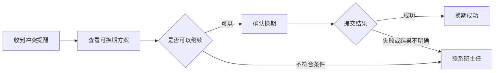

# 用户自主换期

> 文档状态：待评审｜端：App｜正式 PRD：[用户自主换期｜正式 PRD](complex-formal-prd.md)

## 1. 需求背景

### 1.1 背景与现状

发生排课冲突后，用户当前需要联系班主任处理。冲突识别和提醒触发由上游系统负责，App 只接收结果并向用户展示。

### 1.2 当前问题

符合换期条件的用户缺少自主处理入口，必须通过班主任完成本可自行确认的操作。用户也无法在 App 内直接获知换期结果。

## 2. 需求目标

- 符合条件的用户可以在 App 内完成一次自主换期，并明确知道操作结果；
- 不符合条件或无法完成换期的用户可以立即找到班主任兜底。

## 3. 需求范围

| 本期包含 | 本期不包含 / 保持不变 |
|---|---|
| App 冲突提醒、换期入口、方案确认、结果反馈和人工兜底 | 冲突计算、冲突占比、提醒规则与触发时机 |
| 用户仅可成功换期一次 | 班主任归属不变；不支持用户重试 |

## 4. 产品方案

上游触发冲突提醒后，App 向用户说明冲突并提供换期入口。用户选择可换期方案并确认；成功时展示结果，资格不符或提交未成功时转为联系班主任。

### 4.1 用户流程

## 5. 需求详情

### 5.1 冲突提醒—说明问题并提供入口

- 仅在收到上游触发时展示提醒；未触发时 App 不提供换期入口。
- 页面展示冲突结果，不展示冲突占比和计算过程。
- 用户可进入换期流程，或退出后继续使用 App。

### 5.2 可换期方案—完成选择并明确限制

- 展示上游返回的全部可选方案；用户选择其中一个后进入确认。
- 确认前明确说明“仅可换期一次，换期后班主任不变”。
- 若进入后发现不符合条件，拦截继续操作，并提供“联系班主任”按钮。

### 5.3 提交换期—根据结果给出单一出口

| 结果 | 页面反馈 | 后续操作 |
|---|---|---|
| 成功 | 已换期成功 | 完成并退出流程 |
| 不符合条件 | 当前无法自主换期，请联系班主任协助处理 | 联系班主任 |
| 失败或结果不明确 | 换期未完成，请联系班主任协助处理 | 联系班主任 |

提交中不允许重复操作。所有非成功结果均不提供重试入口。

## 6. 通用规则与异常

- 同一冲突关系是否再次提醒由上游系统判断，App 不重复实现该规则；
- 资格在流程中变化、取消后的临时选择、重进冲突优先级和通用失败文案尚未定义，相关交互在确认前不得补造。

## 7. 验收标准

- 收到触发的符合条件用户可以完成方案选择、确认并看到“已换期成功”；
- 未收到触发的用户在 App 内看不到换期入口；
- 不符合条件、失败或结果不明确时均被拦截，且仅提供联系班主任出口；
- 页面明确说明仅可成功换期一次，换期后班主任不变；
- 正文未展示冲突计算、接口字段或内部处理过程。

## 关联资料

- 正式 PRD：[用户自主换期｜正式 PRD](complex-formal-prd.md)
